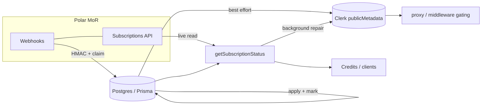

<div align="center">
  <h1>💼 AlexDjangoX</h1>
  <h3>Full-Stack Developer | AI Solutions</h3>
  
  <div style="margin: 20px 0;">
    
    
    
    
    
    
    
    
    
  </div>
</div>

---

## ⚡ **Quick Facts**

| **🎯 Focus**             | **🏗️ Architecture**  | **🤖 AI Integration** | **🧪 Testing**              |
| :----------------------- | :------------------- | :-------------------- | :-------------------------- |
| Full-Stack Development   | Multi-Tenant Systems | OpenAI GPT-4          | Jest, Playwright, Artillery |
| Enterprise Solutions     | Real-time Features   | Realtime API          | E2E Testing                 |
| Polish Language Learning | Secure API Gateway   | Stream Chat           | TypeScript                  |

---

## 👤 **About Me**

<div style="font-size: 16px; line-height: 1.6;">

I am a **Full-Stack Developer** specializing in enterprise AI solutions and multi-tenant applications.

**🎯 My Expertise:**

- **Modern Web Technologies** - Next.js 16.2, React 19, TypeScript 5.9
- **Internationalization** - next-intl v4 on the App Router (ICU messages, always-prefixed locales, bundle-aware route loading, proxy-integrated middleware)
- **AI Integration** - OpenAI GPT-4, Realtime API, Whisper, TTS, custom prompts
- **Enterprise Architecture** - Multi-tenant systems, secure APIs, payment processing
- **Polish Language Learning** - Combined technical & linguistic expertise with 20+ interactive learning modules

**💼 Current Project:**
**PoliLex** - A sophisticated AI-powered language learning platform demonstrating enterprise-level architecture, multi-tenancy, real-time AI integration, and production-ready DevOps practices.

</div>

---

## 📌 **Current Project: PoliLex**

<div align="center">

[](https://lexical-verb.vercel.app/)

**Polish language learning platform with sophisticated full-stack architecture**

<br />


_PoliLex Bilingual — home page with conjugation table and hero messaging_

</div>

---

## 🛠️ **Tech Stack Overview**

| **Category**                 | **Technology / Tools**                               | **Purpose**                                          |
| :--------------------------- | :--------------------------------------------------- | :--------------------------------------------------- |
| **Frontend**                 | Next.js 16.2, React 19                               | Core application shell and interactive UI            |
|                              | **next-intl** v4 (ICU, App Router)                   | Locale routing, server/client translation, SEO       |
|                              | TypeScript 5.9                                       | Type-safe client-side development                    |
|                              | Tailwind CSS 4.1, ShadCN / Radix UI                  | Design system, layout, and reusable UI components    |
|                              | Lexical 0.44, Framer Motion                          | Rich authoring experience and high-quality motion    |
| **Backend & Infrastructure** | Prisma 7.8, PostgreSQL, Supabase                     | Type-safe data access and relational persistence     |
|                              | Clerk Auth, Polar, Stream Chat                       | Authentication, payments, real-time messaging        |
| **Testing & Quality**        | Jest (**5,792+** cases), React Testing Library       | Unit and integration coverage for components & logic |
|                              | Playwright                                           | End-to-end browser regression on critical journeys   |
|                              | Artillery                                            | Load and performance validation for APIs and flows   |
|                              | TypeScript (strict), Prisma, Zod, @t3-oss/env-nextjs | Static typing and schema validation across the stack |
|                              | ESLint, Prettier, import-sorting plugins             | Automated linting, formatting, and code consistency  |
| **AI & Integrations**        | OpenAI GPT-4, DALL-E 3                               | Language processing and image generation             |
|                              | OpenAI Realtime API, Whisper API, OpenAI TTS         | Real-time voice, speech-to-text, and text-to-speech  |
|                              | Tambo AI                                             | Conversational AI with persistent threads            |
|                              | Stream Chat                                          | Real-time chat and collaboration                     |

---

## 🏆 Key Achievements

<div style="font-size: 16px; line-height: 1.6;">

### Multi-Tenant Architecture

- **Authentication & Database Integration** - Sophisticated user management with role-based access control
- **Company portals** with isolated data and secure tenant boundaries
- **Multi-Organization Support** - Seamless switching between different company portals
- **Permission Management** - Granular access control for teachers, students, and admins
- **Data Isolation** - Company-specific data segregation with secure tenant boundaries

### Enterprise Security & API Management

- **Zuplo API Gateway** - Secure API management, rate limiting, and enterprise-grade security
- **Enterprise Security** - Role-based access control & secure authentication
- **Performance Optimized** - SSR, edge caching, optimized database queries, route-level code splitting for heavy editor/chat/PDF dependencies
- **SSR-Safe UI** - Verb/category pickers use Radix Popover + cmdk (`CreatableCombobox`); legacy `react-select` removed with ESLint enforcement
- **Comprehensive Testing** - **5,792+** Jest cases plus Playwright E2E on critical journeys

### AI-Powered Features

- **GPT-4 Integration** - Personalized instruction and content generation
- **OpenAI Realtime API** - Voice conversations with real-time streaming responses
- **Whisper API** - Audio transcription for podcasts and video content
- **Text-to-Speech (TTS)** - AI-generated audio pronunciation
- **Stream Chat** - Real-time messaging with Firebase push notifications (see dedicated section below)
- **Tambo AI Chat Integration** - Advanced conversational AI with thread-based persistence, custom interactive components, and integrated token-based costing system (see dedicated section below)
- **Custom AI Prompts** - Specialized language learning prompts and instructions

### Comprehensive Learning Modules

**Grammar Labs:**

- **Aspect Master** - Verb aspect practice with quizzes, challenges, and timeline visualization
- **Reflexive Lab** - Reflexive verb journeys with categories and templates
- **Preposition Lab** - Interactive preposition challenges with case governance
- **Declension** - Dedicated case-practice flow: game rounds, per-case panels, session bootstrap and reconciliation, and interactive exercise text segments (next-intl)
- **Motion Lab** - Verbs of motion (unidirectional/multidirectional pairs)
- **Verb Prefixes** - Perfective prefix forms and transformations
- **Conjugator** - Interactive Kanban board for verb conjugation practice

**Vocabulary & Practice:**

- **Counting** - Grammatical cases through counting 1-21 with contextual examples
- **Adjectives** - Comparative forms and interactive exercises
- **Adverbs** - Comparative and superlative forms practice
- **Nouns** - Auto-generated flashcards with translations
- **Occupations** - 5 interactive games (Flashcards, Quiz, Memory, Drag & Drop, Sentence Builder)
- **Word Wizard** - AI-assisted vocabulary building with audio pronunciation
- **Flashcards** - Customizable flashcards with example sentences
- **Cases** - Grammatical case mastery through fill-in-the-blank exercises
- **Days & Months** - Temporal vocabulary practice
- **Genealogy** - Interactive family tree drag-and-drop game

**Interactive Content:**

- **Lexical Editor** - Rich text editing with collaborative features
- **PDF Processing** - Document processing and annotation
- **Portable Documents** - PDF viewer with highlighting capabilities
- **Podcasts** - Audio content with transcription
- **Videos** - Video learning with interactive features
- **Audio Transcript** - Speech-to-text processing

**Community & Social:**

- **Real-time Chat** - Stream Chat with FCM push notifications (see dedicated section)
- **Memory Games** - Polish language memory recall activities
- **Jira Integration** - Project management and task tracking
- **Company Portals** - Multi-tenant learning environments with blogs, videos, and PDFs

### OpenAI Pricing Strategy

**Source of Truth:**

- **Database-Driven Pricing** - Centralized database table serves as the single source of truth for all OpenAI model costs
- **Manual Admin Management** - Pricing is manually updated by administrators through a secure admin interface (no automated scraping or external API dependencies)
- **Performance Optimization** - Server-side pricing cached with configurable TTL for optimal performance, with immediate cache invalidation after updates
- **Resilience** - Fallback pricing values available if database is temporarily unavailable (with appropriate logging and warnings)

**Security Practices:**

- **Defense in Depth** - Multi-layer security approach combining application-level authorization checks with database-level access controls
- **Row-Level Security** - Database policies enforce role-based access control, ensuring only authorized administrators can modify pricing data
- **Read Access** - Authenticated users can read active pricing information required for cost calculations
- **Write Access** - Strictly limited to authorized administrators through verified authentication mechanisms
- **Secure Initialization** - Seed scripts use secure service-level connections for initial data population
- **Token-Based Authorization** - Admin privileges verified through secure token claims validated at both application and database layers

### Custom Lexical Editor with Media Integration

- **Rich Text Editing** - Full-featured Lexical editor with markdown support, tables, lists, and formatting
- **YouTube Integration** - Embed YouTube videos directly in editor content with resizable player controls
- **Audio/Podcast Integration** - Seamless audio embedding with Supabase storage integration
  - Audio playback controls with custom player interface
  - Podcast image support with signed URL generation
  - Audio transcription workflow integration
- **Video Content Creation** - Link videos to editor content for bilingual text generation
- **Speech-to-Text** - Built-in speech recognition plugin for voice input
- **Auto-Embed Plugin** - Automatic detection and embedding of YouTube URLs
- **Collaborative Features** - Real-time editing capabilities with history tracking
- **On-Demand Heavy Dependencies** - Excalidraw, emoji picker (`@emoji-mart/*`), and similar tools load via `React.lazy` / dynamic `import()` when opened — not in the initial editor shell
- **Resilient Emoji Picker** - `EmojiMartPicker` surfaces load/retry UI if dynamic imports fail (no stuck loading state)
- **Export Capabilities** - Export editor content to blog posts and learning materials

### Teacher/Tutor Portal (Company System)

- **Dedicated Company Portals** - Isolated multi-tenant environments for each teaching organization
- **Blog Management System** - Full-featured blog with Lexical editor integration
  - Rich text blog posts with embedded media
  - Tag-based categorization and filtering
  - Comments and reactions system
  - Nested comment threads with real-time updates
  - Author profiles and post attribution
  - Draft and published post status management
- **Video Library Management** - Comprehensive video content system
  - YouTube video integration with metadata
  - Difficulty level categorization (A1-C2)
  - Category organization (Grammar, Vocabulary, Pronunciation, etc.)
  - Bilingual text support (Polish/English)
  - Video transcription and summaries
  - Thumbnail and duration tracking
  - Publishing workflow
- **Resource Management** - Centralized content hub
  - PDF document management
  - Resource organization by company
  - Access control and permissions
- **Dashboard Analytics** - Company-specific insights and user management
- **Multi-User Support** - Role-based access for teachers, admins, and students
- **Tenant Isolation** - Secure data segregation between different companies

</div>

---

<h3 style="color: #fbbb74; margin: 16px 0 24px 0; font-weight: 300; font-style: italic; font-size: 1.3rem;">
    Click any section below to expand and read the details.
</h3>

<details style="margin-bottom: 16px;">
<summary style="cursor: pointer; font-size: 1.1rem;"><strong>⚡ Next.js 16 Partial Prerendering — Architecture & Standards</strong> — cacheComponents, dual Prisma, skeleton system, ESLint enforcement, CI</summary>

<div align="center">
<em>Production-grade PPR implementation: static HTML shells from CDN, dynamic content streamed per-request, zero loading spinners</em>
</div>

<br/>

**Status:** ✅ **Production — May 2026**

### Version History

| Milestone                            | Date            | What shipped                                                                                                                                                                                  |
| :----------------------------------- | :-------------- | :-------------------------------------------------------------------------------------------------------------------------------------------------------------------------------------------- |
| `cachedPrisma` + `safeFetch` loaders | Nov 2025        | Dual Prisma client split; `safeFetch` utility and per-route loader pattern established                                                                                                        |
| Next.js 16 upgrade                   | Feb 12, 2026    | Bumped to 16.1.6 (latest available at the time); `cacheComponents: true` attempted but abandoned — Clerk's `auth()` inside `'use cache'` caused build failures with no workaround at the time |
| `unstable_cache` production baseline | Feb–May 2026    | Continued using `unstable_cache` / `unstable_cacheLife` / `unstable_cacheTag` as the stable caching strategy while `cacheComponents` remained blocked                                         |
| **First successful PPR**             | **May 8, 2026** | Clerk `HangingPromiseRejectionError` solved via `AuthRequiredError` + silent fallback in `claimsFn`; `cacheComponents: true` live for the first time across all routes                        |
| `'use cache'` migration              | May 8, 2026     | Full codebase migrated from `unstable_*` to stable `'use cache'` directive, `cacheLife()`, `cacheTag()`                                                                                       |
| `cache-utils/` consolidation         | May 8, 2026     | `safe-fetch`, `cache-ttl`, `cache-monitor`, `dynamic-loader`, `invalidate` unified into `src/lib/cache-utils/`                                                                                |
| `dynamicLoader()`                    | May 8, 2026     | `React.cache()` + `connection()` encapsulated as a single primitive; applied across all 17 loader files                                                                                       |
| `invalidate.*()` helpers             | May 8, 2026     | Typed cache invalidation API replacing raw `revalidateTag()` strings across all server actions                                                                                                |
| ESLint enforcement                   | May 8, 2026     | `local/no-cached-prisma-outside-use-cache` rule; `no-restricted-syntax` for `console.error` in actions                                                                                        |
| Bundle lazy-load + combobox migration | May 2026        | Excalidraw, emoji-mart, Stream Chat, `react-pdf` moved to async chunks; `react-select` removed → `CreatableCombobox` / `VerbCombobox` (SSR-safe, keyboard-accessible clear) |

Every route in PoliLex is a Partial Prerender (`◐`): the static shell (nav, layout, skeleton UI) is pre-generated at build time and served from CDN with instant TTFB. Dynamic content — auth state, user data, subscription status — streams in behind `<Suspense>` boundaries. The entire application uses the Next.js 16 `'use cache'` directive with `cacheLife()` profiles rather than route-segment config — cache policy lives next to the data, not scattered across page files.

### `src/lib/cache-utils/` — Unified Cache Module

All caching concerns live in a single, purpose-built module. Nothing cache-related is scattered across `src/lib/utils/`, `src/lib/constants/`, or individual action files:

| File                | Responsibility                                                                     |
| :------------------ | :--------------------------------------------------------------------------------- |
| `cache-ttl.ts`      | TTL constants & `STABLE_DATA_CACHE_LIFE` — single numeric source of truth          |
| `safe-fetch.ts`     | `safeFetch()` — loader error handling with `AuthRequiredError` cause-chain walking |
| `dynamic-loader.ts` | `dynamicLoader()` — wraps `React.cache()` + `connection()` for every loader        |
| `invalidate.ts`     | `CACHE_TAGS` + `invalidate.*()` — all tag strings and typed invalidation helpers   |
| `cache-monitor.ts`  | `cacheMonitor` singleton — hit/miss metrics, health summary, invalidation tracking |

### Core Configuration

`next.config.mjs` imports `STABLE_DATA_CACHE_LIFE` directly from `src/lib/cache-utils/cache-ttl.ts` via `jiti`. The `cacheLife` config entry and every `cacheLife()` call inside `'use cache'` functions reference the same object — values cannot drift between build config and runtime:

```ts
// Single source of truth — next.config.mjs reads the same object 'use cache' functions use
const { STABLE_DATA_CACHE_LIFE } = jiti(
  resolve(__dirname, './src/lib/cache-utils/cache-ttl.ts'),
);
const nextConfig = {
  cacheComponents: true,
  cacheLife: { 'stable-data': STABLE_DATA_CACHE_LIFE }, // stale 1h / revalidate 7d / expire 30d
};
```

### `dynamicLoader()` — Zero-Boilerplate Loaders

`dynamicLoader()` is a composable primitive that encapsulates the two framework requirements every loader must satisfy: `React.cache()` for per-request memoisation, and `connection()` to register dynamic context before any I/O so Next.js doesn't attempt to statically prerender the route. Without `connection()`, native TCP Prisma queries are invisible to the framework's static-analysis pass and the build throws a `crypto.randomUUID()` error at compile time.

Wrapping these two concerns into a single utility means the pattern is structurally impossible to get wrong — you cannot forget `connection()`, call it in the wrong order, or accidentally duplicate `cache()` boilerplate. It works identically for zero-argument and parameterised loaders:

```ts
// Zero-argument loader
export const loadAdjectivesData = dynamicLoader(async () =>
  safeFetch(getAdjectiveCollectionData, fallback, 'Error:'),
);

// Parameterised loader — types flow through automatically
export const loadAspectPairs = dynamicLoader(
  async (limit: number): Promise<AspectPairsResult> =>
    safeFetch(() => getCachedAspectPairs({ limit }), fallback, 'Error:'),
);
```

### `invalidate.*()` — Typed Cache Invalidation

Raw `revalidateTag()` calls are never used directly in server action files. All cache invalidation goes through named helpers exported from `src/lib/cache-utils/invalidate.ts`, which owns every tag string as a single typed constant:

```ts
// Tag strings defined once — callers never write raw strings
invalidate.adjectives();
invalidate.blog.post(companyId, postId); // touches POST_DETAIL + POSTS_LIST + ANALYTICS atomically
invalidate.openaiCosts(model); // optional fine-grained model tag + the aggregate tag
```

The advantage over raw `revalidateTag()` is threefold: tag strings cannot be misspelled (TypeScript errors at the call site), related tags are always invalidated together (e.g. a blog post change also clears the post list and analytics), and the full set of tags in the system is discoverable in one place rather than grep-scattered across action files.

### Dual Prisma Client Pattern

`auth()` (reads cookies/headers) must never be called inside a `'use cache'` function. The project exports two separate Prisma clients at the infrastructure level:

| Client         | Context                                               | RLS                             |
| :------------- | :---------------------------------------------------- | :------------------------------ |
| `cachedPrisma` | Inside `'use cache'` functions — public / shared data | Anonymous RLS (empty claims)    |
| `prisma`       | Loaders and server actions — user-scoped data         | Auth RLS (Clerk session claims) |

The `prisma` client's `claimsFn` wraps `auth()` in try/catch and silently returns empty claims during PPR prerendering (when no request context exists), preventing build failures.

### ESLint Enforcement

Two custom rules in `eslint.config.mjs` catch cache and logging mistakes at write time:

**`local/no-cached-prisma-outside-use-cache`** — warns when `cachedPrisma` is used inside a function that doesn't start with `'use cache'`. Catches accidental RLS bypass. Set to `warn` because the rule cannot trace call stacks — helpers designed to be called _from_ `'use cache'` functions are valid uses:

```ts
// Blog posts are public data — anonymous RLS is intentional here.
/* eslint-disable local/no-cached-prisma-outside-use-cache */
const [posts, total] = await Promise.all([cachedPrisma.blogPost.findMany(...)]);
/* eslint-enable local/no-cached-prisma-outside-use-cache */
```

**`no-restricted-syntax` on `console.error`** — warns in all `src/lib/actions/actions.*.ts` and `src/app/api/**/*.ts` files, pointing developers to `logUserError()` instead. `logUserError` silently swallows `AuthRequiredError` (expected during PPR prerendering) and uses `error.message` + stack-frame fallback rather than `error.constructor.name`, which production minifiers mangle to single letters:

```ts
// Bad — constructor names mangle to 'i' or 'c' in production builds
console.error(
  'Update failed:',
  error instanceof Error ? error.constructor.name : typeof error,
);

// Good — always produces useful output in production
logUserError('Update failed:', error);
```

`src/lib/actions/actions.podcast.ts` is fully on this pattern (including best-effort
wordplay analysis logging at publish).

### Silent Auth Fallback During Prerendering

During static prerendering there is no request context, so Clerk's `auth()` rejects with an internal `HangingPromiseRejectionError`. The solution is a typed `AuthRequiredError` class defined in a **client-safe** module (`src/lib/errors/auth-errors.ts`) with no server-only imports — essential because auth error detection runs in both server and client contexts:

```ts
// Brand property survives minification — class names mangle to 'i' or 'c' in production
export class AuthRequiredError extends Error {
  readonly isAuthRequiredError = true;
}
```

All auth-gate helpers (`requireAuth`, `requireAdmin`, `requireSubscription`) catch `HangingPromiseRejectionError` and re-throw `AuthRequiredError`. A shared `safeFetch` utility in every page loader suppresses auth errors with **cause-chain walking** — if an action re-wraps `new Error('...', { cause: authErr })`, `safeFetch` recurses through `.cause` and still silently discards it:

```ts
function isAuthRequired(error: unknown): boolean {
  if (error instanceof AuthRequiredError) return true;
  if (
    error instanceof Error &&
    (error as AuthRequiredError).isAuthRequiredError
  )
    return true;
  if (error instanceof Error && error.cause) return isAuthRequired(error.cause); // recursive
  return false;
}
```

`logUserError` replaces bare `console.error` in all action catch blocks. It falls back to `error.stack` frame extraction when `error.message` is empty — production minifiers mangle constructor names to single letters, making `error.constructor.name` useless as a log value.

### `connection()` for cachedPrisma-only Pages

Next.js tracks dynamic context through `fetch()`, `cookies()`, `headers()`, and `connection()`. Native TCP Prisma queries are not tracked. Pages whose first I/O is `cachedPrisma` (no preceding `auth()`) must call `await connection()` explicitly to register dynamic context — otherwise `crypto.randomUUID()` inside the Prisma PG adapter throws at build time:

> Route "/video" used `crypto.randomUUID()` before accessing either uncached data or Request data.

`connection()` lives in the **loader function**, not the page component, keeping framework internals out of the UI layer.

### Navigation + streaming skeleton system

Most feature routes use **`<Suspense fallback={<FeatureSkeleton />}>`** around async server work or **`use(promise)`** (see `docs/cache-components/CACHE_COMPONENTS.md` Pattern 8). **There is no `src/app/loading.tsx`** (no root segment loading file). Only **two** segment **`loading.tsx`** files exist today (`src/app/[lang]/(landing)/onboarding/loading.tsx` and `src/app/[lang]/(home)/test-rls/loading.tsx`); do not duplicate the same loading UX with both segment `loading.tsx` and page-level Suspense for the same subtree.

Clerk’s async **`ClerkProvider`** in **`src/app/[lang]/layout.tsx`** uses **`AppShellSkeletonWithPage`** ( **`NavbarSkeleton`** + **`SuspenseFallbackChrome`** ) as the Suspense fallback while **`getKeylessStatus`** runs.

**Skeleton standards:** extract skeletons to `src/components/<feature>/*Skeleton*.tsx`; match layout tokens and `dark:` variants; prefer shared chrome helpers from `@/lib/skeleton-chrome` where applicable.

### CI Pipeline

`.github/workflows/pr-checks.yml` runs three jobs on every PR:

| Job              | Commands                             | Catches                                                          |
| :--------------- | :----------------------------------- | :--------------------------------------------------------------- |
| `lint-and-types` | `npm run lint && npm run type-check` | ESLint violations incl. `cachedPrisma` rule, TS errors           |
| `test`           | `npm run test -- --ci --forceExit`   | Unit and integration regressions                                 |
| `build`          | `npm run build` (requires secrets)   | Missing `connection()`, `auth()` in `'use cache'`, crypto errors |

The `build` job is the **only** place missing `connection()` calls surface — these errors only occur during `next build`, not `next dev`. Fork PRs skip it automatically (GitHub withholds secrets from forks).

### Architecture Decisions

| Decision                                                         | Rationale                                                                                                                                    |
| :--------------------------------------------------------------- | :------------------------------------------------------------------------------------------------------------------------------------------- |
| No `export const dynamic = 'force-dynamic'`                      | Explicitly incompatible with `cacheComponents: true` — opt-in to dynamic is done via `connection()` inside loaders                           |
| No route-level `export const revalidate = N`                     | Cache policy lives in `'use cache'` functions via `cacheLife()`, not at the page level — co-located with the data it covers                  |
| No `unstable_cache` / `unstable_cacheLife` / `unstable_cacheTag` | These were the correct Next.js 15 APIs; Next.js 16 stabilised them — the `unstable_` prefix is gone and the stable forms are used throughout |
| No `export const runtime = 'nodejs'`                             | Node.js is the default runtime; Edge runtime is unsupported with `cacheComponents` and incompatible with native Prisma                       |
| No spinner fallbacks                                             | Prefer route-appropriate skeleton components in `<Suspense fallback>` or segment `loading.tsx` — never an unstyled spinner for streamed work |

### Canonical docs (engineers)

[`docs/cache-components/CACHE_COMPONENTS.md`](./docs/cache-components/CACHE_COMPONENTS.md) — Cache Components, Suspense, loaders, patterns.  
[`docs/cache-components/CACHE_STRATEGY.md`](./docs/cache-components/CACHE_STRATEGY.md) — cache tags, invalidation.  
[`docs/next-intl/NEXT_INTL.md`](./docs/next-intl/NEXT_INTL.md) — next-intl (routing, bundles, `src/proxy.ts`).  
[`docs/bundle-size/BUNDLE_SIZE.md`](./docs/bundle-size/BUNDLE_SIZE.md) — analyzer workflow, baselines, lazy-load targets.

</details>

<details style="margin-bottom: 16px;">
<summary style="cursor: pointer; font-size: 1.1rem;"><strong>🎨 UI components & client bundle discipline</strong> — SSR-safe comboboxes, lazy-loaded editor deps, measurable baselines</summary>

<div align="center">
<em>Design-system primitives first; heavy npm packages only when the user opens the feature</em>
</div>

<br/>

### Combobox / select migration (2026-05)

| Before | After |
| :----- | :---- |
| `react-select` + Emotion (~80 lines of theme `styles` per surface) | **`CreatableCombobox`** (Radix Popover + cmdk) + thin **`VerbCombobox`** wrapper |
| Hydration risk on SSR routes | Tailwind semantic tokens; no CSS-in-JS injection |
| `isMounted` gates masking mismatches | Root cause fixed; ESLint **`no-restricted-imports`** blocks `react-select` reintroduction |

**Consumers:** flashcards add-verb modal, conjugator scrape wizard, podcast/conversation subtitle fields, adjective/adverb/occupation pickers, Wordplay text processor, Word Wizard / Spelling Master categories.

**Engineering details:** large verb lists use A–Z browse batches + scroll load; clear control is keyboard- and screen-reader-accessible; conjugation wizard resets fetched verb state when the user picks a different lemma (prevents stale inject). Internal specs: [`docs/AUDIT-MD/SELECT_AUDIT.md`](./docs/AUDIT-MD/SELECT_AUDIT.md).

### Lazy-load quick wins (2026-05)

| Dependency | Pattern | User-visible surface |
| :--------- | :------ | :------------------- |
| `@excalidraw/excalidraw` | `React.lazy` | Editor diagram plugin |
| `@emoji-mart/react` + data | `import()` on mount | Toolbar / blog emoji picker |
| `stream-chat-react` | `next/dynamic` | `/chat` authenticated stream |
| `react-pdf` / `pdfjs-dist` | dynamic viewer | Portable documents route |

**Measurement:** `npm run bundle:baseline` + `scripts/compare-bundle-baseline.mjs` against checked-in baselines; `npx next experimental-analyze` for per-route graphs. Combined static JS stayed ~flat while CSS dropped ~349 KiB after splitting heavy CSS out of the eager graph.

</details>

<details style="margin-bottom: 16px;">
<summary style="cursor: pointer; font-size: 1.1rem;"><strong>🌍 Internationalization (next-intl)</strong> — App Router, bundle-size–aware messages, proxy integration, RSC boundaries</summary>

<div align="center">
<em>Production localization (next-intl): always-prefixed locales, lean server config, per-route message slices, shared error semantics across server and client</em>
</div>

<br/>

**Stack:** [**next-intl**](https://next-intl.dev/) v4 · **ICU MessageFormat** in JSON · locales **`en`** (default) · **`pl`**

PoliLex treats internationalization as a first-class platform concern: routing, middleware, layout boundaries, and client bundles are aligned so senior reviewers can reason about locale, payload size, and React 19 / Next.js 16 constraints in one place.

### Routing & URLs

| **Concern**            | **Implementation**                                                                                                                                                                                                                               |
| :--------------------- | :----------------------------------------------------------------------------------------------------------------------------------------------------------------------------------------------------------------------------------------------- |
| Single source of truth | `defineRouting()` in `src/intl/routing.ts` — `locales`, `defaultLocale`, **`localePrefix: 'always'`** (every URL is `/{lang}/...`), **`localeDetection: true`**, **`NEXT_LOCALE`** cookie (`sameSite: 'lax'`, 30-day TTL).                       |
| Navigation API         | `createNavigation(routing)` in `src/intl/navigation.ts` exports **`Link`**, **`redirect`**, **`usePathname`**, **`useRouter`**, **`getPathname`** — use these instead of raw `next/link` / `next/navigation` where locale rewriting is required. |
| Language switcher      | `src/components/language-select/LanguageSelector.tsx` — `useRouter` + `usePathname` from `@/intl/navigation`, `router.replace(pathname, { locale })` for same-path locale changes.                                                               |

### Middleware (`src/proxy.ts`)

| **Concern**           | **Implementation**                                                                                                                                                                         |
| :-------------------- | :----------------------------------------------------------------------------------------------------------------------------------------------------------------------------------------- |
| Locale                | `createIntlMiddleware(routing)` handles unprefixed entry, negotiates from cookie / `Accept-Language`, **307** redirects to prefixed paths.                                                 |
| Server locale context | Forwarded request headers preserve **`X-NEXT-INTL-LOCALE`** so RSC and `getRequestConfig` see the same locale as the edge middleware (avoids “URL changed but copy stayed in old locale”). |
| Coexistence           | Same file chains **Clerk** (`clerkMiddleware`), **subscription gating**, bot blocking, and tenant routing **after** the intl middleware branch where applicable.                           |

_Next.js 16:_ proxy lives at `src/proxy.ts` (Node runtime by default for this file — no segment `runtime` export in the proxy module.)

### Layout split (theme vs locale)

| **Layer**                         | **Role**                                                                                                                                                                                                                                                                                                                                                                                                                               |
| :-------------------------------- | :------------------------------------------------------------------------------------------------------------------------------------------------------------------------------------------------------------------------------------------------------------------------------------------------------------------------------------------------------------------------------------------------------------------------------------- |
| **`src/app/layout.tsx`**          | Owns **`<html>`** and **`<body>`**, root **metadata/viewport**, **`ThemeProvider`**, and analytics. **`lang`** on `<html>` is **`fallbackLng`** for SSR; the active routed locale updates **`document.documentElement.lang`** from **`IntlClientShell`** (**`DocumentLangFromSegment`**) once the **`[lang]`** tree mounts — same spirit as **`ThemeProvider`** above the locale segment (**`docs/next-intl/NEXT_INTL.md`** §6 / §11). |
| **`src/app/[lang]/layout.tsx`**   | **Async** `await params`, **`IntlClientShell`**, then **`<Suspense fallback={<AppShellSkeletonWithPage />}>`** around **`ClerkProvider`** only (Pattern 3 — Clerk’s async RSC / `getKeylessStatus`). **App chrome** (nav, main, footer) and **`{children}`** (inner **`Suspense fallback={null}`**) live inside Clerk.                                                                                                                 |
| **`src/app/[lang]/template.tsx`** | Client `LangTemplate`: **`ViewTransition name="page"`** for `ApplicationNavigation` + View Transition API. Lives under `[lang]` so markup stays under `<body>`. **`ViewTransition`** always renders a **stable `<div>`** when `name` is set and applies `view-transition-name` in `useEffect` — avoids fragment→`div` remount and first-load “double paint”.                                                                           |

**`cacheComponents`:** uncached async work from **`ClerkProvider`** must sit inside **`<Suspense>`**. **`params`** are **not** hidden behind that fallback: the layout **`await`s `params`** first so locale + intl mount without flashing the full **`AppShellSkeletonWithPage`** for segment resolution alone (see **`docs/next-intl/NEXT_INTL.md`** §6).

### Server config (`getRequestConfig`)

| **Property**                         | **Purpose**                                                                                                                                                                                                                                                                                                                                                                                                                                                                                                                                                                |
| :----------------------------------- | :------------------------------------------------------------------------------------------------------------------------------------------------------------------------------------------------------------------------------------------------------------------------------------------------------------------------------------------------------------------------------------------------------------------------------------------------------------------------------------------------------------------------------------------------------------------------- |
| **`locale`**                         | Resolved from `requestLocale` with fallback to `routing.defaultLocale`.                                                                                                                                                                                                                                                                                                                                                                                                                                                                                                    |
| **`timeZone: 'UTC'`**                | Global default — removes `ENVIRONMENT_FALLBACK` warnings and avoids SSR/client **date** markup drift.                                                                                                                                                                                                                                                                                                                                                                                                                                                                      |
| **`onError` / `getMessageFallback`** | Shared with the client via `src/intl/error-handling.ts`. **Do not disable `MISSING_MESSAGE` globally** as a substitute for keeping JSON in sync — treat gaps as technical debt: diff `t()` / `useTranslations` call sites against the locale JSON, or temporarily tighten **`intlOnError`** on a throwaway branch to surface `MISSING_MESSAGE` for review. Today **`intlOnError`** still no-ops `MISSING_MESSAGE` so legacy **OR**-chained **`t()`** fallbacks stay usable; **`getMessageFallback`** returns **`''`** so those chains behave as intended without throwing. |
| **No global `messages` blob**        | Keeps **`getRequestConfig`** minimal for bundle and RSC payload hygiene; messages are mounted at route boundaries (below).                                                                                                                                                                                                                                                                                                                                                                                                                                                 |

Plugin wiring: `createNextIntlPlugin('./src/intl/request.ts')` in **`next.config.mjs`**; `next-intl` listed in **`optimizePackageImports`**.

### Client root provider: `IntlClientShell`

| **Constraint**                                      | **Solution**                                                                                                                                                                                                                                                                                                  |
| :-------------------------------------------------- | :------------------------------------------------------------------------------------------------------------------------------------------------------------------------------------------------------------------------------------------------------------------------------------------------------------ |
| RSC cannot pass function props to client components | **`IntlClientShell`** (`'use client'`) imports **`intlOnError`** / **`intlGetMessageFallback`** and passes them into **`NextIntlClientProvider`** with **`timeZone="UTC"`** and root **`messages`** from **`ROOT_SHELL_MESSAGES_BY_LOCALE`**.                                                                 |
| `<html lang>` vs split root/`[lang]` layout         | **`DocumentLangFromSegment`** inside **`IntlClientShell`** uses **`useLayoutEffect`** so **`document.documentElement.lang`** matches the **`locale`** prop (aligned with next-intl’s **`html lang={locale}`** beside the provider — [Request configuration](https://next-intl.dev/docs/usage/configuration)). |
| Nested providers                                    | Per-route **`RouteTranslations`** / **`ClientRouteTranslations`** nest **`NextIntlClientProvider`** so **`use-intl`** inherits the same error/fallback behavior.                                                                                                                                              |

### Per-route messages (bundle size)

| **Primitive**                 | **Use**                                                                                                                       |
| :---------------------------- | :---------------------------------------------------------------------------------------------------------------------------- |
| **`src/intl/bundles/*.ts`**   | Typed **`Record<Language, …>`** maps per feature/route; each file composes namespaces needed for that tree.                   |
| **`RouteTranslations`**       | Server component: slices messages for the current locale only.                                                                |
| **`ClientRouteTranslations`** | Client variant for `'use client'` subtrees; active locale via **`useLocale()`** from the parent **`NextIntlClientProvider`**. |
| **JSON**                      | `src/intl/locales/{en,pl}/*.json` — **ICU** placeholders `{var}`, `{count, plural, …}`.                                       |

### Ancillary helpers & SEO

| **Item**                         | **Location**                                                                                                     |
| :------------------------------- | :--------------------------------------------------------------------------------------------------------------- |
| Strip `/{locale}` for path logic | **`splitLocalePrefix`** — `src/lib/intl/locale-path.ts` (used by proxy wiring, protected-route checks, exam UI). |
| hreflang / alternates            | **`src/app/sitemap.ts`** (and metadata patterns documented in **`docs/next-intl/NEXT_INTL.md`**).                |

### Testing

| **Approach**       | **Detail**                                                                                                                                                                                                                                                                                                                |
| :----------------- | :------------------------------------------------------------------------------------------------------------------------------------------------------------------------------------------------------------------------------------------------------------------------------------------------------------------------ |
| Jest               | **`__tests__/setup/next-intl.ts`** mocks **`next-intl`**, **`next-intl/server`**, **`next-intl/navigation`**, plus lightweight stubs for **`next-intl/routing`** / **`next-intl/middleware`** where ESM parsing would otherwise break. **`useTranslations`** is stable per-namespace (avoids effect churn in hook tests). |
| Deterministic copy | **`TEST_TRANSLATIONS`** map for keys assertions need real strings, not raw ids.                                                                                                                                                                                                                                           |

### Full reference

End-to-end file map, code pointers, SEO, and edge-case notes: **[`docs/next-intl/NEXT_INTL.md`](./docs/next-intl/NEXT_INTL.md)**

</details>

<details style="margin-bottom: 16px;">
<summary style="cursor: pointer; font-size: 1.1rem;"><strong>💳 Production Payment Infrastructure (v2.5)</strong> — Source of truth &amp; sync (Polar → DB → Clerk), webhooks, customer &amp; period events, custom UI, observability</summary>

<div align="center">
<em>Enterprise-grade subscription and payment system built with financial software engineering standards</em>
</div>

<br/>

**System Status:** ✅ **v2.5 — Production Ready** (April 2026; v2.4 live validation March 2026)

### Version History

| Version | Date         | Focus                                                                                                                                   |
| :------ | :----------- | :-------------------------------------------------------------------------------------------------------------------------------------- |
| v2.1    | Jan 2026     | Three-layer security hardening: Zuplo edge IP allowlist, HMAC webhook verification, Prisma `Serializable` isolation                     |
| v2.2    | Jan 28, 2026 | `subscription.created` event support, duplicate transaction prevention, custom in-app subscription UI replacing Polar portal            |
| v2.3    | Jan 28, 2026 | Payment failure UX (`PaymentFailureAlert`, `past_due` flow), automated reconciliation / cleanup / webhook-recovery crons                |
| v2.4    | March 2026   | Modular webhook handlers (`src/hooks/webhooks/polar/`), explicit `claimWebhookEvent` + `markWebhookEventProcessed` idempotency refactor |
| v2.5    | April 2026   | `customer.state_changed` first-class handler, `period.ended` routing, order de-duplication, structured file-sink logging                |

### Billing: Polar (Merchant of Record)

**Polar** is the payment and subscription stack for **international tax compliance** and simplified global operations. It acts as Merchant of Record, handling VAT, GST, and sales tax obligations across 100+ countries—reducing operational burden versus acting as the merchant of record yourself.

**Business Value:**

- ✅ **Automatic Tax Compliance** — Polar calculates, collects, and remits taxes globally
- ✅ **Merchant of Record** — Polar assumes tax liability as the legal seller
- ✅ **Zero Tax Registration** — Sell worldwide without jurisdiction-specific registrations
- ✅ **Simplified Operations** — Single integration, worldwide coverage, reduced overhead

### Source of truth & state synchronization

**Principle: Polar is the source of truth** for **subscription and order state** (what the customer is entitled to, what was charged, and what Polar’s API returns). Nothing in the app “overrules” Polar for billing reality: **Postgres** holds **materialized** state and **app-derived** fields (e.g. token balances from your rules applied to Polar events); **Clerk** is a **cache** for fast auth and Edge gating. If Postgres or Clerk **lag** Polar, **reconciliation and live reads** converge back to Polar — see crons and `getSubscriptionStatus` / `resolvePolarSubscriptionForAccount`.

**Mental model:** one authority (**Polar**), two projections (**DB** = durable + tokens, **Clerk** = session cache), with explicit **sync** and **repair** paths.

#### Who owns what

| **Layer**                                                         | **Role**                                                                                                                                                                                                                                                                                                                                                                                                                                                                                   | **In code**                                                                                                                                                                                                                             |
| :---------------------------------------------------------------- | :----------------------------------------------------------------------------------------------------------------------------------------------------------------------------------------------------------------------------------------------------------------------------------------------------------------------------------------------------------------------------------------------------------------------------------------------------------------------------------------- | :-------------------------------------------------------------------------------------------------------------------------------------------------------------------------------------------------------------------------------------- |
| **Polar** (API + webhooks)                                        | **Source of truth** for subscription _identity_ and orders: MoR records, what was paid, period boundaries, and signed webhooks. Live API reads and webhook streams are the same commercial reality.                                                                                                                                                                                                                                                                                        | `src/app/api/webhook/polar/route.ts` → handlers; `getPolarClient()`; `getPolarSubscriptionState` / `resolvePolarSubscriptionForAccount` in `src/lib/polar/subscription-state.ts`                                                        |
| **PostgreSQL** (Prisma: `User`, `Transaction`, `WebhookEvent`, …) | **Materialized + app ledger** — **not** a second billing authority. Stores balances and polar\* columns **as applied from Polar events** (webhooks, crons) plus idempotency keys. Token math is your product policy **on top of** Polar-driven tier/order facts.                                                                                                                                                                                                                           | Webhook handlers under `src/hooks/webhooks/polar/`; `src/lib/polar/cron/polar-reconciliation.ts`, etc.                                                                                                                                  |
| **Clerk `publicMetadata`**                                        | **Read-optimized cache** for the session and Edge: plan, `hasActiveSubscription`, payment flags. If **`syncClerk` fails** after a webhook, the handler still succeeds: the **webhook was already applied to Postgres from Polar’s event** — only Clerk is stale. _“The DB is the source of truth; Clerk is a cache…”_ in `src/hooks/webhooks/polar/sync-clerk.ts` means **Clerk** must not block money writes; **Polar** already decided the event; **Postgres** holds the applied result. | `syncClerk`; `syncClerkPublicMetadataFromDatabase` in `src/lib/clerk/sync-public-metadata-from-database.ts`                                                                                                                             |
| **Client** (credits UI)                                           | **Consumes** server-computed status; does not invent billing state.                                                                                                                                                                                                                                                                                                                                                                                                                        | `getSubscriptionStatus()` — `src/lib/actions/actions.subscriptions.ts`; `useSubscriptionPolling` + `SubscriptionProvider` — `src/components/credits/subscription/`; token UI may use `useTokenBalance` — `src/store/useTokenBalance.ts` |

#### Write path (money events)

1. Polar sends a webhook → **`validateEvent`** (`@polar-sh/sdk/webhooks`) on `src/app/api/webhook/polar/route.ts`.
2. **Claim** → **`claimWebhookEvent`** (`src/lib/polar/webhook-idempotency.ts`) — unique row per `provider` + `eventType` + `eventId` (P2002 = duplicate delivery, skip).
3. **Apply** → e.g. `transitionSubscription`, `handleTopup`, `applyCustomerStateChanged`, `handleOrderRefunded` — **Prisma** updated (balances, rows).
4. **Mark** → **`markWebhookEventProcessed`** with a `resultSnapshot`.
5. **Best-effort Clerk** → **`syncClerk`** so middleware/UI see fresh metadata **after** the DB commit (failures logged; do not roll back money).

#### Read path (UI, credits, gating)

- **`getSubscriptionStatus()`** (`src/lib/actions/actions.subscriptions.ts`):
  - Always reads **tokens** and stable user keys from **Prisma**.
  - Merges **live Polar** via **`resolvePolarSubscriptionForAccount`** so subscription _identity_ matches **Polar** when the API is available (overrides a stale **local** mirror). If Polar is unreachable, response falls back to last-known DB state (logged) — a **degraded** read, not a second authority.
  - **Edge case** in code: if Polar’s API shows no sub yet the DB has a still-valid `polarCurrentPeriodEnd` (e.g. migration/restored user), access may be granted from DB **until** Polar and reconciliation **align** — treat as **bridging**, not a competing SoT.
  - **Background** **`syncClerkMetadataInBackground`** — repairs Clerk from computed state **without** blocking the response (comments: Clerk is a cache; webhooks are primary).
- **Sign-in / mobile:** **`syncClerkPublicMetadataFromDatabase`** — re-hydrates Clerk from **Prisma + Polar** (see file header: _“Polar query failure is non-fatal — falls back to existing DB data”_). Used e.g. by **`POST /api/me/sync-public-metadata`** (Bearer JWT) for clients with empty metadata.
- **Route protection:** `src/proxy.ts` — subscription gating calls **`evaluateSubscriptionGate`** in `src/lib/polar/derive-subscription-status.ts` (same rules as the former inline block; **Clerk** `publicMetadata` only, Edge-safe).

#### Reconciliation (scheduled)

Daily crons and **`retryWebhookEvent`** (see _Automated Maintenance System_) re-align **DB** and **Clerk** **to Polar** when webhooks are missed or processes crash after claim; see `src/lib/polar/cron/webhook-retry.ts` and related routes.

#### Flow diagram


```mermaid
flowchart LR
  subgraph polar [Polar MoR]
    WH[Webhooks] --- API[Subscriptions API]
  end
  WH -->|HMAC + claim| DB[(Postgres / Prisma)]
  DB -->|apply + mark| DB
  DB -->|best effort| Clerk[(Clerk publicMetadata)]
  API -->|live read| GS[getSubscriptionStatus]
  DB --> GS
  GS -->|background repair| Clerk
  GS --> UI[Credits / clients]
  Clerk --> MW[proxy / middleware gating]
```

### System Architecture

**Design Principles:**

- **Polar as source of truth** — Subscription and order reality comes only from **Polar** (webhooks + API). Postgres and Clerk are **projections**; drift is **corrected** toward Polar (live reads, reconciliation, crons).
- **Financial Software Standards** — Zero tolerance for bugs where money is involved; heavy Jest coverage on `__tests__/lib/polar` + `__tests__/api/webhook` (**632** tests) and dedicated state-machine matrices
- **Database-Backed Idempotency** — Claim→apply→mark via `claimWebhookEvent` + `markWebhookEventProcessed` in `src/lib/polar/webhook-idempotency.ts` (insert claim, P2002 = duplicate); stable `eventId`s prevent double-processing
- **Fail-Closed for Money** — Balance mutations fail-closed; metadata sync fail-open for optimal reliability
- **Event-Driven Processing** — Asynchronous webhook handlers with state machine validation and transaction atomicity
- **Live Validated** — 100% congruency verified across Polar ↔ Backend ↔ Clerk ↔ Frontend through comprehensive E2E testing
- **Custom UI Control** — In-app subscription management (v2.2) for 95% of operations, Polar portal for payment-sensitive 5%

| **Component**         | **Implementation**                                                                                                                                                                                                                                                   |
| :-------------------- | :------------------------------------------------------------------------------------------------------------------------------------------------------------------------------------------------------------------------------------------------------------------- |
| API Integration       | `getPolarClient()` — `src/lib/polar/client.ts` (`@polar-sh/sdk`); `withRetry` / `withRetryConditional` — `src/lib/polar/retry.ts` (default `maxRetries: 3` → up to **4** attempts, exponential backoff + jitter)                                                     |
| Security Layer        | Multi-layer validation (Zod schemas + business logic allowlists)                                                                                                                                                                                                     |
| Webhook entry         | `src/app/api/webhook/polar/route.ts` — `validateEvent` from `@polar-sh/sdk/webhooks`, then dispatch to handlers below                                                                                                                                                |
| Webhook Processing    | Modular handlers in `src/hooks/webhooks/polar/`; HMAC + claim→mark idempotency for subscription / `customer.state_changed`; top-up orders use claim→mark inside `handleTopup` / `handleOrderRefunded`                                                                |
| Error Handling        | Sanitized user messages; internal details never exposed                                                                                                                                                                                                              |
| State Synchronization | **Polar → Prisma (webhooks + crons) → best-effort Clerk**; **reads** via `getSubscriptionStatus` (Polar live merge + DB tokens); see **Source of truth & state synchronization** above; client: `SubscriptionContext` / polling; `useTokenBalance` for token UI only |
| Debug & observability | `logPolar` / `src/lib/polar/debug/polar-logger.ts`; per-request `src/lib/polar/webhook-file-logger.ts`; `npm run logs:view` / `logs:clear` / `logs:tail` → `src/lib/polar/debug/view-polar-logs.js`                                                                  |

### Dual-Balance Token System

**Architecture:**

- **Subscription Tokens** (`tokenBalance`) — Tier allocation from `getCreditsForProductId` / `CREDIT_ALLOCATIONS` in `src/lib/polar/utils.ts` (e.g. 1,000 Pro, 2,500 Premium; free tier `FREE_TIER_CREDITS` = **100**)
- **Top-up Tokens** (`topupTokenBalance`) — Purchased tokens, persist indefinitely
- **Spending Priority** — Subscription tokens consumed first (monthly reset), then top-up tokens (never expire)
- **Balance Preservation** — Subscription changes preserve purchased tokens via pure calculation: `newBalance = newCredits + max(0, currentTotal - oldCredits)`

**Example:** User with 1,500 tokens (1,000 subscription + 500 purchased) upgrades to 2,500-credit plan → Final balance: 3,000 tokens (2,500 new subscription + 500 preserved top-up)

### Security Implementation (v2.1 Hardened)

**Three-Layer Defense-in-Depth:**

1. **Edge Protection (Zuplo API Gateway)**
   - IP allowlisting for webhooks (Polar's 5 official IPs only)
   - Rate limiting (100 req/min webhooks, 20 req/min checkouts)
   - Comprehensive audit logging with IP, user agent, timestamp

2. **Application Layer**
   - Multi-layer validation (Zod UUID → Business logic allowlist → Runtime auth)
   - HMAC signature verification via Polar SDK on all webhook payloads
   - Database-backed idempotency — `claimWebhookEvent` + `markWebhookEventProcessed` with stable keys (duplicate insert P2002 → skip)
   - Prisma `Serializable` isolation where used for race-sensitive billing/user updates (see e.g. critical user action paths)
   - Zero-trust metadata (token amounts derived from productId only, not client data)

3. **Data Layer**
   - Clerk authentication required for all server actions
   - Row-level security policies on Supabase
   - Transaction audit trail with polarId tracking
   - Error sanitization (no internal details exposed to users)

### Webhook Event Handling

**Event matrix** (subscription + `customer.state_changed` use claim→mark on the route; **top-up** `order.paid` / `order.refunded` claim inside `handleTopup` / `handleOrderRefunded` for top-up products only):

| Event                                        | Action                                                                                                                                  | Since |
| :------------------------------------------- | :-------------------------------------------------------------------------------------------------------------------------------------- | :---- |
| `subscription.created`                       | First subscribe / FREE → ACTIVE                                                                                                         | v2.2  |
| `subscription.active`                        | Allocate tier credits, plan ID, Clerk sync                                                                                              |       |
| `subscription.updated`                       | Recalculate balance, top-up preservation, plan changes                                                                                  |       |
| `subscription.canceled`                      | → `CANCELED_PENDING` in state machine; `transitionSubscription` sets cancel-at-period-end or clears immediately if period already ended |       |
| `subscription.revoked`                       | Immediate downgrade, clear subscription fields                                                                                          |       |
| `subscription.uncanceled`                    | Restore subscription, clear payment warnings                                                                                            | v2.3  |
| `subscription.past_due`                      | Payment failed flag + credits UX                                                                                                        | v2.3  |
| `period.ended` / `subscription.period_ended` | Period boundary via `transitionSubscription`                                                                                            | v2.5  |
| `customer.state_changed`                     | Customer snapshot: `applyCustomerStateChanged` (empty active list + valid period guard, state machine, Clerk)                           | v2.5  |
| `order.paid` / `order.updated` (paid)        | Top-ups; **`subscription_create` skipped** when subscription events own the flow                                                        | v2.5  |
| `order.refunded`                             | Deduct purchased tokens, audit                                                                                                          |       |

**v2.2 Refinements (Jan 28, 2026):**

- **`subscription.created` Support** — Polar sends this event first; state machine now handles it correctly
- **Clear `freeTrialEndDate`** — Explicitly nulled when upgrading from free to paid plans
- **Duplicate Transaction Prevention** — Pre-existence check eliminates constraint errors
- **Custom UI Implementation** — Migrated from Polar portal to in-app subscription management for greater control

**v2.3 Automation & UX (Jan 28, 2026):**

- **Payment Failure Handling** — Complete UX flow for failed payments:
  - `PaymentFailureAlert.tsx` component with prominent "Fix Payment" CTA
  - Alert displays on credits page when `subscription.past_due` webhook received
  - Shows period end date and redirects to Polar portal for secure payment update
  - `ManageSubscriptionBadge.tsx` prioritizes payment failure button above all other actions
  - 2 new test scenarios added to credits page test suite
- **Reconciliation Cron** — Automated DB-Clerk desync detection and healing (daily at 3 AM UTC; Hobby-compatible)
- **Cleanup Cron** — Automated webhook event pruning (daily at 2 AM UTC, 30-day retention)
- **Cron Security** — Bearer token authorization, IP logging, fail-open error handling
- **Operational Observability** — Comprehensive logging of execution metrics, desync rates, cleanup counts

**v2.4 Webhook Refactor & Idempotency (March 2026):**

- **Modular Webhook Handlers** — Logic in `src/hooks/webhooks/polar/` (state-machine, subscription-transition, **customer-state-changed**, topup, order-refund, sync-clerk, retry)
- **Idempotency Hardening** — Explicit `claimWebhookEvent` + `markWebhookEventProcessed` flow; deprecated `checkAndMarkWebhookEventProcessed`
- **Direct Integration Tests** — 13 tests for claim→mark flow, replay prevention, fail-closed behavior

**v2.5 Customer, period & order hardening (April 2026):**

- **`customer.state_changed`** — First-class handler (`applyCustomerStateChanged`) for Polar's customer-level snapshot: reconciles `active_subscriptions` with the database, with guards when the list is empty but the paid period is still valid, then state-machine + Clerk sync where appropriate; stable idempotency keys per customer + subscription shape.
- **Period end** — `period.ended` and `subscription.period_ended` wired through the same `transitionSubscription` + claim→mark path as other subscription events (explicit payload mapping for `subscription_id` / period fields).
- **Order de-duplication** — `order.paid` / paid `order.updated` **skips** `subscription_create` when the subscription stream already owns allocation, reducing double-processing noise.
- **Operations visibility** — Rich structured logging on the webhook route (`logPolar`); optional **file-sink** tracing via `webhook-file-logger` (claim, customer state, orders, result/end markers) to support E2E and production debugging; CLI helpers `logs:view`, `logs:clear`, `logs:tail` in `package.json`.
- **Surface area** — `src/hooks/webhooks/polar/index.ts` exports `applyCustomerStateChanged` alongside existing transition, topup, refund, and retry modules.

### State machine & test architecture

**Runtime (single source of truth in code):**

- **Pure state core** — `src/hooks/webhooks/polar/state-machine.ts`: `reduceSubscriptionState` (5 states × `SUBSCRIPTION_EVENTS` including `period.ended`), `reducePlanChange`, `deriveStateFromDb` — no database or network calls.
- **Typed constants** — `src/hooks/webhooks/polar/polar-types.ts` exposes `SubscriptionState` / `SubscriptionEvent` and runtime arrays `SUBSCRIPTION_STATES` + `SUBSCRIPTION_EVENTS` (and `SUBSCRIPTION_STATE` / `SUBSCRIPTION_EVENT` maps) so tests can iterate **every** state and event in lockstep with the reducer.
- **Orchestration** — `src/hooks/webhooks/polar/subscription-transition.ts` loads the user, computes `currentState` → `nextState` via the reducer, then executes **per-`nextState`** branches (ACTIVE, PAST_DUE, CANCELED_PENDING with period-edge logic, FREE, REVOKED) including Clerk sync and optional transaction rows.
- **Token math isolated** — `src/hooks/webhooks/polar/subscription-token-balance.ts`: `computeActiveTransitionTokenBalance` and `computeRevokedTransitionTokenBalance` mirror the ACTIVE/REVOKED paths (incl. `polarSubscriptionIdChanged` for new checkout rows, `likelyStaleUpgrade` to avoid clobbering an already-credited balance, lateral/NONE).
- **Idempotency helpers** — `subscriptionEventId` and `subscriptionPayloadSnapshot` live next to `transitionSubscription` and encode `period.ended` as `period_ended:{subId}` (and `modifiedAt` / period end where needed).

**How tests are layered (no parallel “fake” state machine in production tests):**

| Layer                       | File                                                            | Role                                                                                                                                                                                                                                                                                          |
| :-------------------------- | :-------------------------------------------------------------- | :-------------------------------------------------------------------------------------------------------------------------------------------------------------------------------------------------------------------------------------------------------------------------------------------- |
| Matrix + money              | `__tests__/lib/polar/webhook-subscription-transitions.test.ts`  | `calculateTokenBalance` / `compute*` / `subscriptionEventId`; **full Cartesian** `SUBSCRIPTION_STATES` × `SUBSCRIPTION_EVENTS` vs an `EXPECTED_TRANSITIONS` matrix; `deriveStateFromDb`; multi-step user journeys on the **real** `reduceSubscriptionState`                                   |
| Production branches         | `__tests__/hooks/webhooks/polar/transitionSubscription.test.ts` | **Imports production** `transitionSubscription`; mocks only Prisma, `syncClerk`, loggers — covers guards, each `nextState` arm, token and transaction edge cases                                                                                                                              |
| Webhook + customer          | `__tests__/api/webhook/polar-state-machine-integration.test.ts` | **Production** `transitionSubscription` and `applyCustomerStateChanged` with shared Prisma mocks; scenario-driven (upgrade, cancel, period end, past_due, invalid transitions, `customer.state_changed`); file header states explicitly: same modules as the route, **no** separate simulator |
| Historical fixes            | `__tests__/api/webhook/polar-fixes-validation.test.ts`          | Documents early behavioral fixes; uses a **local inline** reducer subset for that narrative (not the import graph) — kept for regression storytelling                                                                                                                                         |
| Cross-layer (status + gate) | `__tests__/lib/polar/subscription-layer-consistency.test.ts`    | Polar-shaped `subscriptionStatus` via `subscriptionStatusFromPolarState` vs **Clerk-shaped** `evaluateSubscriptionGate` (proxy); `deriveSubscriptionStatusForSessionResponse` vs session lag — **contract** table for one rules story                                                         |

**Takeaway:** transitions are **provable** at the pure layer (exhaustive matrix), **verified** on the real async function, **cross-checked** against customer-level events, and **aligned** across proxy / credits server / Clerk metadata via `src/lib/polar/derive-subscription-status.ts` + consistency tests.

### Custom UI Evolution: From Portal to In-App Experience

**Strategic Decision (Jan 28, 2026):** Migrated from Polar's hosted customer portal to **custom React components** for subscription management, achieving **greater control** over user experience and business logic.

**Why Custom UI?**

Initially, the system relied on Polar's customer portal for all subscription operations (cancel, upgrade, downgrade). While functional, this approach had limitations:

- **Context Switching** — Users redirected to external portal, breaking in-app flow
- **Limited Control** — Couldn't customize confirmation dialogs or messaging
- **Branding Disconnect** — External portal didn't match application's design language
- **No Analytics** — Couldn't track user interactions with subscription UI
- **Inflexible UX** — Portal workflow not optimized for our use cases

**Custom Implementation:**

Built **4 subscription UI entry points** (primary Jest files: **246** tests total) handling common operations in-app:

| **Path**                                                                    | **Responsibility**                               | **Tests (Jest)**                                               |
| :-------------------------------------------------------------------------- | :----------------------------------------------- | :------------------------------------------------------------- |
| `src/components/credits/subscription/plans/SubscriptionPlans.tsx`           | Plan display, upgrade/downgrade UI               | 51 (`__tests__/components/credits/SubscriptionPlans.test.tsx`) |
| `src/components/credits/ManageSubscriptionBadge.tsx`                        | Current plan badge, actions, payment failure CTA | 29                                                             |
| `src/components/credits/ConfirmationDialog.tsx`                             | Upgrade / downgrade / cancel confirmations       | 19                                                             |
| `src/components/credits/subscription/plans/hooks/useSubscriptionActions.ts` | Centralized subscription actions                 | 22 (integration: `SubscriptionActionsIntegration.test.tsx`)    |

**Benefits Achieved:**

- **Seamless Experience** — All subscription actions in-app, no context switching
- **Full Control** — Custom confirmation dialogs with clear, contextual messaging
- **Consistent Branding** — Matches application design system and internationalization (Polish/English)
- **Enhanced UX** — Real-time feedback with granular loading states per action
- **Business Logic** — Payment processing locks prevent concurrent operations
- **Analytics Ready** — Track every user interaction with subscription UI

**Hybrid Approach:**

Smart delegation between custom UI and Polar portal:

| **Operation**           | **Handled By** | **Reason**                            |
| :---------------------- | :------------- | :------------------------------------ |
| Subscribe to plan       | Custom UI      | In-app flow, immediate feedback       |
| Upgrade/Downgrade       | Custom UI      | Show plan comparison, confirm changes |
| Cancel subscription     | Custom UI      | Confirmation dialog, show end date    |
| Reactivate subscription | Custom UI      | One-click reactivation                |
| View current plan       | Custom UI      | Always visible, integrated with app   |
| Fix failed payment      | Custom UI      | Alert banner with portal redirect     |
| Update payment method   | Polar Portal   | PCI compliance, secure card handling  |
| Download invoices       | Polar Portal   | Tax-compliant documents               |
| View payment history    | Polar Portal   | Complete transaction records          |
| Manage billing address  | Polar Portal   | International tax compliance          |

**Technical Architecture:**

```
User clicks "Upgrade to Premium"
         ↓
Custom UI shows confirmation dialog
         ↓
User confirms → Server action (changePlan)
         ↓
Redirect to Polar checkout (payment collection)
         ↓
User completes payment → Polar webhook
         ↓
Database + Clerk metadata sync
         ↓
Frontend polling detects change
         ↓
Custom UI updates (new plan badge, token balance)
```

**Result:** 95% of subscription interactions handled in-app with seamless UX, while Polar portal handles payment-sensitive operations (5% of use cases) requiring regulatory compliance.

### Automated Maintenance System (v2.3 — Jan 28, 2026)

**Proactive Health & Data Management:**

Implemented **automated cron jobs** to maintain system health and prevent data bloat without manual intervention.

**Polar Reconciliation Cron** (`/api/cron/polar-reconciliation`):

- **Schedule**: Daily at 4:00 AM UTC
- **Purpose**: Sync database and Clerk with Polar (source of truth)
- **Process**: For each user with polarCustomerId, query Polar API, compare with DB, fix mismatches
- **Impact**: Catches re-registration, missed webhooks, manual Polar dashboard changes

**Clerk Reconciliation Cron** (`/api/cron/clerk-reconciliation`):

- **Schedule**: Daily at 3:00 AM UTC (Vercel Hobby–compatible; once per day)
- **Purpose**: Self-healing system that detects and fixes DB-Clerk desynchronization
- **Process**: Scans all users, identifies discrepancies (plan ID, token balance, subscription status), automatically corrects mismatches
- **Monitoring**: Alerts if desync rate exceeds 1%, tracks fix success rate
- **Impact**: Zero manual intervention required; system self-corrects before users notice issues

**Webhook Cleanup Cron** (`/api/cron/webhook-cleanup`):

- **Schedule**: Daily at 2:00 AM UTC
- **Purpose**: Delete webhook events older than 30 days to prevent database bloat
- **Process**: Removes processed webhook records while maintaining audit trail for debugging
- **Retention**: Configurable 30-day history balances compliance with performance
- **Impact**: Prevents `WebhookEvent` table growth, maintains query performance

**Webhook Recovery Cron** (`/api/cron/webhook-recovery`):

- **Schedule**: Daily at 5:00 AM UTC
- **Purpose**: Retry unprocessed webhook events (e.g., crashed between claim and mark)
- **Process**: Finds events with `processedAt: null` in retry window (5 min–24 h old), re-applies via `retryWebhookEvent`
- **Impact**: Self-healing for transient failures; events older than 24 h marked as failed

**Security Architecture:**

- **Authorization**: Bearer token authentication (`CRON_SECRET`) prevents unauthorized execution
- **IP Logging**: Tracks unauthorized access attempts for security monitoring
- **Fail-Open Design**: Returns 200 on error to prevent Vercel retry storms (next scheduled run will retry)
- **Observability**: Comprehensive logging of execution duration, items processed, failure rates

**Operational Metrics:**

- **Reconciliation**: Typically 0.00% desync rate, sub-300ms execution time
- **Cleanup**: ~15,000 events deleted daily, sub-100ms execution time
- **Reliability**: Zero manual intervention required since deployment

**Test Coverage:** `__tests__/app/api/cron` — **57** Jest tests across cron route handlers (authorization, success, errors; run `npx jest __tests__/app/api/cron` for the exact set).

### Quality Assurance & Validation

**Automated Testing (verify with `npm test` — numbers below from Jest as run in dev):**

- **Payment stack** — `__tests__/lib/polar` + `__tests__/api/webhook`: **632** Jest tests (idempotency, webhooks, state machine matrices, `transitionSubscription`, chaos/partial-failure suites)
- **Subscription credits UI** — 246 tests in the four files listed above
- **Cron routes** — 57 tests under `__tests__/app/api/cron`
- **Repo-wide** — **5,792+** Jest test cases (e.g. **5,792** on last full `npx jest` run; count shifts as tests are added)
- **Financial Standards** — Invariants covered by dedicated suites (`webhook-subscription-transitions`, integration routes)
- **E2E** — Playwright on critical journeys (`npm run test:e2e*`)
- **Idempotency** — `__tests__/lib/polar/webhook-idempotency.test.ts` and route integration tests (claim→mark, P2002 duplicates)
- **Security Testing** — Product ID / auth / signature scenarios in API webhook test folders
- **Integration Testing** — `polar-state-machine-integration`, `polar-e2e-scenarios`, real-application suites

**Live Validation (Jan 28, 2026):**

- **7 Real User Scenarios** — Complete subscription lifecycle tested with actual Polar webhooks
- **100% Congruency** — Verified state synchronization across Polar → Database → Clerk → Frontend
- **Token Calculations** — All upgrade/downgrade/cancel/topup scenarios validated with real data
- **Webhook Processing** — ~40 webhook deliveries processed successfully with proper deduplication
- **State Machine** — All transitions tested (FREE → ACTIVE → CANCELED_PENDING → etc.)
- **Payment Failure UX** — Alert component integrated and tested with 2 new scenarios
- **Automated Health Checks** — Reconciliation and cleanup cron jobs deployed and validated

**Test Execution:** see `npm test`; payment-focused folders alone exceed **600** tests; full Jest run is **5,792+** cases (387 suites)

### Comprehensive Documentation

**Seven Complete Guides (367 KB total):**

- **POLAR_IMPLEMENTATION.md** (105 KB) — Complete implementation guide, security architecture, custom UI documentation, phase-by-phase build
- **PAYMENT_IMPLEMENTATION_WALKTHROUGH.md** — Developer walkthrough: Polar as source of truth, claim→apply→mark flow, event handlers, state machine
- **STRIDE_THREAT_MODEL.md** (54 KB) — Security threat analysis, attack scenarios, defense-in-depth validation
- **INTEGRATION_TESTING_SUMMARY.md** (9 KB) — Live testing results, all 7 scenarios documented, token calculation details
- **DEVELOPER_QUICK_REFERENCE.md** (6 KB) — Quick reference for daily work, schemas, debugging tips
- **VALIDATION_REPORT_2026-01-28.md** (13 KB) — Complete validation report with before/after comparisons
- **CRON_IMPLEMENTATION.md** (68 KB) — Automated maintenance system documentation, cron job architecture, monitoring guide
- **RECOMMENDATIONS.md** (112 KB) — Technical recommendations for hardening, observability, and production readiness

**Custom UI Components:**

- `src/components/credits/subscription/plans/SubscriptionPlans.tsx` — Plan display, upgrade/downgrade/cancel
- `src/components/credits/ManageSubscriptionBadge.tsx` — Plan badge, actions, fix-payment when `paymentFailed`
- `src/components/credits/ConfirmationDialog.tsx` — Upgrade / downgrade / cancel confirmations
- `src/components/credits/PaymentFailureAlert.tsx` — Payment failure banner (v2.3)
- `src/components/credits/subscription/plans/hooks/useSubscriptionActions.ts` — Centralized server-action wiring for the credits flow

**Security Rating:** 9.8/10 ⭐⭐⭐ (Enterprise-grade with Zuplo edge protection)

</details>

<details style="margin-bottom: 16px;">
<summary style="cursor: pointer; font-size: 1.1rem;"><strong>📝 React 19 Form Architecture</strong> — Progressive enhancement, server actions, useActionState</summary>

<div align="center">
<em>Progressive enhancement meets type-safe server actions</em>
</div>

<br/>

Modern form architecture leveraging React 19 hooks and Next.js 16 server actions for optimal DX and performance.

### Architecture Overview

| **Component**        | **Responsibility**                 | **Pattern**                                   |
| :------------------- | :--------------------------------- | :-------------------------------------------- |
| Client-Side State    | Form validation & user interaction | React Hook Form with Zod resolver             |
| Server Actions       | Data mutations & persistence       | Next.js 16 `action` prop with `FormData` API  |
| State Management     | Server response handling           | `useActionState` for declarative state        |
| Event Handlers       | Stable callbacks without deps      | `useEffectEvent` for effect event handlers    |
| Field Watching       | Reactive form updates              | `useWatch` for optimized re-renders           |
| Context Architecture | Complex form state sharing         | Provider pattern with memoized context values |

### Core Patterns

- **Progressive Enhancement** — Forms work without JavaScript using native `FormData` submission, enhanced with client-side validation when available
- **Type-Safe Validation** — Dual-layer Zod schema validation (client-side React Hook Form + server-side `safeParse`) ensures data integrity at every boundary
- **Optimized Re-renders** — `useWatch` replaces `form.watch()` for granular field subscriptions, eliminating unnecessary component updates
- **Stable Event Handlers** — React 19's `useEffectEvent` provides dependency-free callbacks for effect handlers, removing dependency array confusion
- **Data-Driven Rendering** — Configuration objects with `map()` eliminate JSX repetition while maintaining type safety and readability

### Server Action Flow

```
┌─────────────────────────────────────────────────────────────┐
│  1. User submits form → <form action={formAction}>          │
├─────────────────────────────────────────────────────────────┤
│  2. Client-side validation → React Hook Form + Zod          │
├─────────────────────────────────────────────────────────────┤
│  3. FormData serialization → Native browser behavior        │
├─────────────────────────────────────────────────────────────┤
│  4. Server action invoked → useActionState manages pending  │
├─────────────────────────────────────────────────────────────┤
│  5. Server-side validation → Zod safeParse with structured  │
│     error responses                                          │
├─────────────────────────────────────────────────────────────┤
│  6. Database mutation → Prisma with RLS policies            │
├─────────────────────────────────────────────────────────────┤
│  7. Response handling → useEffectEvent for success/error    │
└─────────────────────────────────────────────────────────────┘
```

### Implementation Highlights

- **Context-Based Complex Forms** — `VerbAttributesForm` uses provider pattern to share state across nested components without prop drilling
- **Field-Level Subscriptions** — Single `useWatch` call for multiple fields, maintaining React Hook Form's optimization benefits
- **Structured Error Handling** — Server actions return typed `ActionState<T>` with success/error/data discriminated unions
- **Test Coverage** — Forms tested with `data-testid` attributes (never text content), ensuring reliable test stability across **next-intl** copy and content changes.
- **Creatable Fields** — Podcast/conversation subtitles and similar flows use **`VerbCombobox`** → **`CreatableCombobox`** with explicit null-clear handling (`opt?.value ?? ''`) for controlled React Hook Form fields.

### Example Architecture

```typescript
// Client Component
import { toast } from '@/lib/toast'; // Sonner wrapper

// Server Action with safeParse validation
export async function submitFormAction(
  prevState: ActionState<DataType>,
  formData: FormData,
): Promise<ActionState<DataType>> {
  const result = schema.safeParse(Object.fromEntries(formData));
  if (!result.success) {
    return { success: false, errors: result.error.flatten().fieldErrors };
  }
  // ... database mutation
  return { success: true, data: createdRecord };
}

const [actionState, formAction, isPending] = useActionState(
  submitFormAction,
  initialState,
);
const watched = useWatch({ control: form.control }); // Single subscription

const handleSuccess = useEffectEvent(() => {
  toast.success('Success!');
  onSuccess?.();
}); // No dependency array needed!

useEffect(() => {
  if (actionState.success) handleSuccess();
}, [actionState.success]);
```

</details>

<details style="margin-bottom: 16px;">
<summary style="cursor: pointer; font-size: 1.1rem;"><strong>🧠 Tambo AI Learning Assistant</strong> — Context-aware conversational AI, persistent threads, interactive components</summary>

<div align="center">
<em>Context-aware conversational AI with persistent threads and interactive components</em>
</div>

<br/>

A sophisticated AI tutoring system powered by Tambo SDK, providing personalized Polish language instruction with full conversation persistence and custom interactive learning components.

### Architecture Overview

| **Component**      | **Responsibility**                  | **Pattern**                                   |
| :----------------- | :---------------------------------- | :-------------------------------------------- |
| TamboProvider      | SDK initialization & thread context | React Context with auth token injection       |
| Thread Persistence | Conversation state management       | localStorage + PostgreSQL hybrid storage      |
| Message Streaming  | Real-time AI response delivery      | Server-Sent Events with generation stages     |
| Component Registry | Dynamic UI rendering from AI        | Zod-validated props with component mapping    |
| Tool Registry      | AI function calling capabilities    | Type-safe tool definitions with input schemas |
| Token Charging     | Usage-based billing integration     | Pre-charge with actual usage reconciliation   |

### Key Features

- **Thread-Based Conversations** — Full conversation history preserved across sessions with automatic restoration on page load
- **Lab-Specific Context** — AI tutor adapts to current learning module (Aspect Master, Reflexive Lab, Preposition Lab, etc.)
- **Custom Interactive Components** — AI can render learning-specific UI:
  - `LearningHintCard` — Contextual tips with difficulty levels and examples
  - `ExerciseGenerator` — Interactive quizzes with real Polish content
  - `ProgressVisualization` — Learning analytics with charts and statistics
- **Thread Management** — Archive conversations with titles/subtitles, restore previous threads, delete old conversations
- **Message Limits** — Configurable per-thread message caps with graceful degradation
- **Token-Based Costing** — Integrated with platform credit system, pre-authorization with actual usage tracking

### Component Architecture

```
┌─────────────────────────────────────────────────────────────┐
│  AITutorAssistant                                           │
│  ├── TamboProvider (SDK Context)                            │
│  │   ├── useTamboThread (conversation state)                │
│  │   └── useTamboThreadInput (message handling)             │
│  ├── ChatHeader                                             │
│  │   ├── ThreadSelector (dropdown with archived threads)    │
│  │   └── ThreadArchiveForm (save with title/subtitle)       │
│  ├── MessageList                                            │
│  │   ├── MessageItem (user/assistant messages)              │
│  │   ├── MarkdownRenderer (formatted responses)             │
│  │   └── LoadingIndicator (streaming state)                 │
│  ├── ChatInput (textarea with send button)                  │
│  └── QuickSuggestions (one-click prompts)                   │
└─────────────────────────────────────────────────────────────┘
```

### Thread Lifecycle

```
┌─────────────────────────────────────────────────────────────┐
│  Thread Creation & Persistence Flow                         │
├─────────────────────────────────────────────────────────────┤
│  1. User opens lab → Check localStorage for saved threadId  │
│  2. If found → Restore thread with retry logic (3 attempts) │
│  3. If not → Create new thread on first message             │
├─────────────────────────────────────────────────────────────┤
│  4. Messages sent → Real-time streaming response            │
│  5. Thread auto-saved → localStorage + database sync        │
│  6. Message count tracked → Update database periodically    │
├─────────────────────────────────────────────────────────────┤
│  7. User archives → Save title/subtitle, mark as archived   │
│  8. New thread created → localStorage cleared, fresh start  │
│  9. User can restore → Select from dropdown, switch thread  │
│  10. User can delete → Permanent removal from database      │
└─────────────────────────────────────────────────────────────┘
```

### Custom Hooks

| **Hook**                | **Purpose**                                          |
| :---------------------- | :--------------------------------------------------- |
| `useThreadPersistence`  | localStorage management, thread ID tracking, restore |
| `useThreadDatabase`     | Background sync of thread metadata to PostgreSQL     |
| `useActualUsageLogging` | Token usage tracking after AI response completion    |

### AI-Rendered Components

The AI can dynamically render interactive learning components by returning structured JSON:

```typescript
// AI returns component specification
{
  "component": "ExerciseGenerator",
  "props": {
    "title": "Verb Aspect Practice",
    "exercises": [
      {
        "question": "Wczoraj _____ (czytać/przeczytać) książkę przez cały dzień.",
        "options": ["czytałem", "przeczytałem", "czytam"],
        "correctAnswer": "czytałem",
        "explanation": "Use imperfective 'czytałem' for duration"
      }
    ]
  }
}

// Component registry maps to React component with Zod validation
const tamboComponents = [
  { name: 'ExerciseGenerator', component: ExerciseGenerator, propsSchema: exerciseGeneratorSchema },
  { name: 'LearningHintCard', component: LearningHintCard, propsSchema: learningHintCardSchema },
  { name: 'ProgressVisualization', component: ProgressVisualization, propsSchema: progressVisualizationSchema }
];
```

### • Database Schema

```sql
model TamboThread {
  id          String    @id @default(cuid())
  userId      String
  labContext  String    -- "aspect-master", "reflexive-lab", etc.
  threadId    String    -- Tambo SDK thread identifier
  title       String?   -- User-provided archive title
  subtitle    String?   -- Optional description
  isCurrent   Boolean   @default(true)
  isArchived  Boolean   @default(false)
  messageCount Int      @default(0)
  createdAt   DateTime  @default(now())
  updatedAt   DateTime  @updatedAt
  archivedAt  DateTime?

  @@unique([userId, labContext, threadId])
}
```

### • Testing Strategy

- **122+ tests** covering Tambo components and integration
- **Component isolation** — Each UI component tested independently with mocked Tambo hooks
- **Integration tests** — Full AITutorAssistant flow with mocked SDK responses
- **Server action tests** — Thread CRUD operations with Prisma mocking

</details>

<details style="margin-bottom: 16px;">
<summary style="cursor: pointer; font-size: 1.1rem;"><strong>💬 Real-Time Chat with Stream & Firebase Push Notifications</strong> — Multi-tenant messaging, FCM push</summary>

<div align="center">
<em>Multi-tenant messaging with cross-platform push notification delivery</em>
</div>

<br/>

A production-grade real-time chat system built on Stream Chat SDK with Firebase Cloud Messaging (FCM) integration for reliable push notifications across web, Android, and iOS.

### Architecture Overview

| **Component**       | **Responsibility**                       | **Pattern**                                      |
| :------------------ | :--------------------------------------- | :----------------------------------------------- |
| Stream Chat Client  | Real-time messaging & channel management | Singleton with Clerk authentication              |
| Firebase Messaging  | Push notification delivery               | FCM with service worker background handling      |
| Push Template API   | Server-side notification configuration   | Stream Chat Push v3 with Handlebars templates    |
| Device Registration | FCM token management with Stream         | `addDevice()`/`removeDevice()` with localStorage |
| Service Worker      | Background notification handling         | Firebase Messaging SW with message listener      |
| Company Isolation   | Multi-tenant user filtering              | Clerk ID validation with company-scoped queries  |

### • Core Features

- **Multi-Tenant Messaging** — Users can only chat with members of their organization through Clerk ID validation and company-scoped user queries
- **Real-Time Updates** — Instant message delivery with typing indicators, read receipts, and presence status via Stream Chat WebSocket
- **Channel Management** — Create, archive, and restore conversation channels with persistent state across sessions
- **Per-Channel Muting** — Users can mute specific channels while maintaining global notification settings
- **Responsive Design** — Adaptive sidebar/channel layout with mobile-first breakpoint management
- **Internationalization** — Polish language support with custom translations via Streami18n

### • Push Notification Architecture

```
┌─────────────────────────────────────────────────────────────┐
│  Push Notification Flow (Stream Chat Push v3 + Firebase)   │
├─────────────────────────────────────────────────────────────┤
│  1. User enables notifications → Browser permission request │
├─────────────────────────────────────────────────────────────┤
│  2. Permission granted → Firebase SDK requests FCM token    │
├─────────────────────────────────────────────────────────────┤
│  3. FCM token obtained → Register with Stream Chat          │
│     via client.addDevice(token, 'firebase', userId)         │
├─────────────────────────────────────────────────────────────┤
│  4. Push template configured → Stream API receives template │
│     with platform-specific notification payloads            │
├─────────────────────────────────────────────────────────────┤
│  5. New message event → Stream sends to Firebase servers    │
├─────────────────────────────────────────────────────────────┤
│  6. Firebase delivers → Service worker receives & displays  │
│     notification even when app is backgrounded/closed       │
└─────────────────────────────────────────────────────────────┘
```

### • Multi-Platform Push Template

Stream Chat Push v3 uses Handlebars-style templates for customizable notifications:

```json
{
  "data": {
    "version": "v2",
    "sender": "stream.chat",
    "type": "{{ event_type }}",
    "channel_id": "{{ channel.id }}",
    "message_id": "{{ message.id }}"
  },
  "android": {
    "priority": "high",
    "notification": {
      "title": "{{ sender.name }}",
      "body": "{{ truncate message.text 150 }}",
      "sound": "default"
    }
  },
  "webpush": {
    "notification": {
      "title": "{{ sender.name }}",
      "body": "{{ truncate message.text 150 }}",
      "icon": "{{ sender.image }}"
    },
    "fcm_options": { "link": "/chat" }
  },
  "apns": {
    "payload": {
      "aps": {
        "alert": {
          "title": "New message from {{ sender.name }}",
          "body": "{{ truncate message.text 150 }}"
        },
        "badge": "{{ unread_count }}",
        "sound": "default"
      }
    }
  }
}
```

### • Component Hierarchy

```
┌─────────────────────────────────────────────────────────────┐
│  ChatPage                                                   │
│  ├── Chat (Stream Chat Provider)                            │
│  │   ├── ChannelIdHandler (deep-link support)               │
│  │   ├── ChannelRestorer (session persistence)              │
│  │   ├── ChatSidebar                                        │
│  │   │   ├── ChannelList (filterable channel list)          │
│  │   │   └── UserSearch (company-scoped user discovery)     │
│  │   └── ChatChannel                                        │
│  │       ├── Menubar                                        │
│  │       │   ├── ThemeToggle                                │
│  │       │   └── PushSubscriptionToggleButton               │
│  │       ├── CustomChannelHeader                            │
│  │       │   └── ChannelNotificationToggle (per-channel)    │
│  │       ├── MessageList                                    │
│  │       └── MessageInput                                   │
│  └── usePushNotifications (FCM hook)                        │
└─────────────────────────────────────────────────────────────┘
```

### • Security & Multi-Tenancy

| **Security Layer**      | **Implementation**                                        |
| :---------------------- | :-------------------------------------------------------- |
| User Authentication     | Clerk-issued tokens validated on both client and server   |
| Company Isolation       | Clerk ID format validation (`user_[a-zA-Z0-9_]+`)         |
| Device Token Management | FCM tokens stored locally, registered server-side only    |
| Push Template Auth      | Server action with `auth()` guard before Stream API calls |
| Channel Access Control  | Stream Chat channel membership enforced at SDK level      |

### • Push Notification Hook

The `usePushNotifications` hook manages the complete FCM lifecycle:

```typescript
interface UsePushNotificationsReturn {
  isSupported: boolean; // Browser supports notifications & Firebase configured
  isEnabled: boolean; // User granted permission
  isLoading: boolean; // Operation in progress
  error: string | null; // Last error message
  enablePushNotifications: () => Promise<boolean>;
  disablePushNotifications: () => Promise<boolean>;
}

// Key responsibilities:
// 1. Check browser support & Firebase configuration
// 2. Register Firebase service worker
// 3. Request notification permission
// 4. Obtain and cache FCM token
// 5. Register/unregister device with Stream Chat
// 6. Auto-register on client reconnection
```

### • Service Worker Implementation

The Firebase Messaging service worker handles background notifications:

```javascript
// firebase-messaging-sw.js
importScripts('firebase/firebase-app-compat.js');
importScripts('firebase/firebase-messaging-compat.js');

// Receive config from main app via postMessage
self.addEventListener('message', (event) => {
  if (event.data?.type === 'FIREBASE_CONFIG') {
    firebase.initializeApp(event.data.config);
    const messaging = firebase.messaging();

    messaging.onBackgroundMessage((payload) => {
      const { title, body, icon } = payload.notification;
      self.registration.showNotification(title, { body, icon });
    });
  }
});
```

</details>

<details style="margin-bottom: 16px;">
<summary style="cursor: pointer; font-size: 1.1rem;"><strong>🛡️ Testing & Quality</strong> — Jest, Playwright, Artillery, type safety</summary>

PoliLex is validated with a **full testing pipeline** that combines automated tests, static analysis, and load testing.  
Every change is validated through:

- **Automated unit and integration suites** using **Jest** (**5,792+** tests across **387** suites) and **React Testing Library** for components and business logic — including combobox primitives (`CreatableCombobox`, `VerbCombobox`), flashcards, and Lexical UI (`EmojiMartPicker` load/error paths)
- **End-to-end regression tests** with **Playwright** for critical user journeys in the browser
- **Load and performance exercises** with **Artillery** focused on core APIs, server-side operations, and caching behavior
- **Strict static typing and schema validation** with **TypeScript (strict mode)**, **Prisma**, **Zod**, and **@t3-oss/env-nextjs** for data, inputs, and configuration
- **Automated linting and formatting** with **ESLint**, **Prettier**, and import-sorting to enforce consistent, production-grade code quality
- **CI pipeline** (`.github/workflows/pr-checks.yml`) running lint, type-check, Jest, and `next build` on every PR — the build step is the only place missing `connection()` calls and `'use cache'` violations surface (see PPR section above)

</details>

<details style="margin-bottom: 16px;">
<summary style="cursor: pointer; font-size: 1.1rem;"><strong>🔗 Resources & Links</strong></summary>

<div align="center">

[](https://www.youtube.com/watch?v=1Q7oyvCVanE)

</div>

</details>

<details style="margin-bottom: 16px;">
<summary style="cursor: pointer; font-size: 1.1rem;"><strong>📚 Background</strong> — Education, training, specialization</summary>

<table width="100%" style="font-size: 16px;">
<tr>
<td width="33%" style="text-align: center; padding: 12px; border: 1px solid #374151; background-color: #1f2937;"><strong>Education</strong></td>
<td width="33%" style="text-align: center; padding: 12px; border: 1px solid #374151; background-color: #1f2937;"><strong>Training</strong></td>
<td width="34%" style="text-align: center; padding: 12px; border: 1px solid #374151; background-color: #1f2937;"><strong>Specialization</strong></td>
</tr>
<tr>
<td style="text-align: center; padding: 12px; border: 1px solid #374151;"><strong>Boolean UK Graduate</strong><br>Full-stack development fundamentals</td>
<td style="text-align: center; padding: 12px; border: 1px solid #374151;"><strong>JS Mastery Graduate</strong><br>(Feb 2024) - Advanced React & Next.js Masterclass</td>
<td style="text-align: center; padding: 12px; border: 1px solid #374151;"><strong>Polish Language Enthusiast</strong><br>Combined technical expertise with language learning</td>
</tr>
</table>

</details>

---

<div align="center">
  <sub style="font-size: 14px;">Always learning, always building. Currently exploring advanced AI integration and enterprise-scale applications. GITHUB.md last updated 2026-05-20.</sub>
</div>
